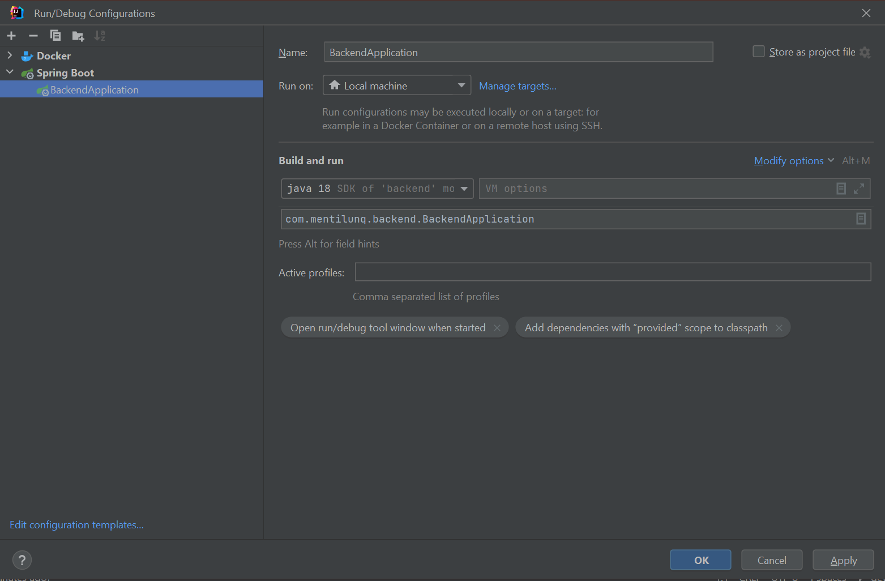
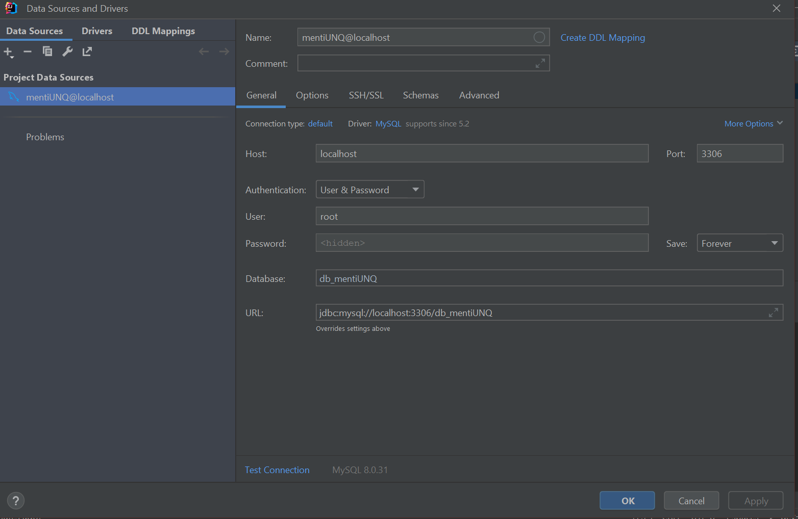

# MentiUNQ - API

## Levantar aplicación
Deberá primero correr el comando `docker compose up` manualmente y luego desde IDEA

 

## Swagger
Acceder luego de levantar la app a: http://localhost:8080/swagger-ui.html

## Versiones 
- Java SDK 11
- Springboot 2.7.3
- Maven 3.8.6

## Docker 
Para levantar el contenedor de MySQL debemor correr `docker compose up` . Podemos configurar DataGrip para crear la conexión:
